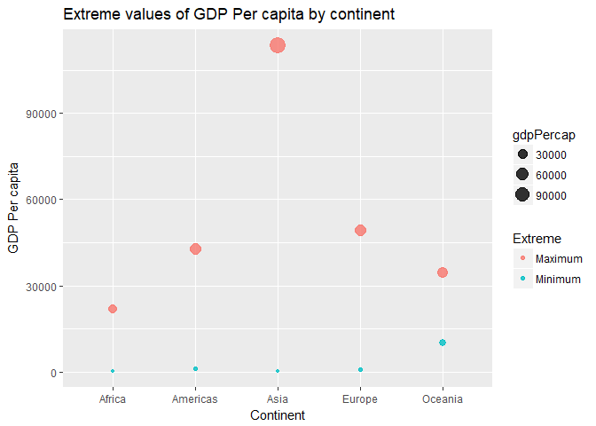
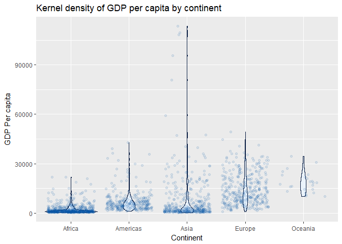
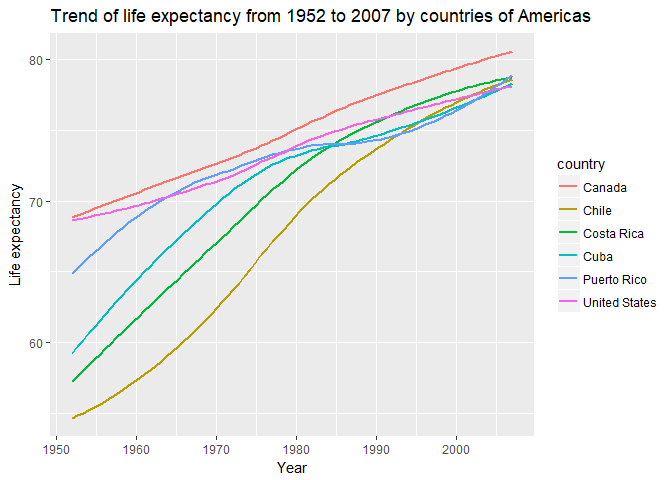

Homework 03: Use dplyr/ggplot2 to manipulate and explore data
================
Cecilia Leon

Task menu
---------

Here are some sample tasks for you to populate your cheat sheet with. If you want to do something comparable but different, i.e. swap one quantitative variable for another, be my guest! If you are feeling inspired and curious, then we're doing this right. Go for it.

-   Get the maximum and minimum of GDP per capita for all continents.

Using `dplyr` I could obtain the maximum and minimum gdpPercap for each cotinent by the following statement:

``` r
T1 <- gapminder %>% 
         group_by(continent) %>% 
         summarize(Minimum = min(gdpPercap),
                   Maximum = max(gdpPercap))

T1
```

    ## # A tibble: 5 x 3
    ##   continent Minimum Maximum
    ##   <fct>       <dbl>   <dbl>
    ## 1 Africa       241.  21951.
    ## 2 Americas    1202.  42952.
    ## 3 Asia         331. 113523.
    ## 4 Europe       974.  49357.
    ## 5 Oceania    10040.  34435.

As I tried to plot maximum and minimum in the same graph by using the previuos table without success, I built the *TT* data frame to have all data about minimum and maximum in the same column, ans extra column called *Exreme* to distinghish maximum and minimum of each continent, after that I could generate the following graph:

``` r
TT <- data.frame(rep(T1$continent,2),
                c(rep("Maximum",nlevels(T1$continent)),rep("Minimum",nlevels(T1$continent))),
                c(T1$Maximum,T1$Minimum))
colnames(TT) <- c("continent","Extreme","gdpPercap")
 
ggplot(TT, aes(continent, gdpPercap, color = Extreme)) +
   geom_point(aes(size=gdpPercap),alpha=0.8) +
   ggtitle("Extreme values of GDP Per capita by continent") +
   xlab("Continent") +
   ylab("GDP Per capita")
```



-   Look at the spread of GDP per capita within the continents.

To look at the spread of gdpPercap of each continent we can check the range of that value by cotinent:

``` r
T1 %>% 
  mutate(Range = Maximum - Minimum) %>% 
  arrange(Range)
```

    ## Warning: package 'bindrcpp' was built under R version 3.3.3

    ## # A tibble: 5 x 4
    ##   continent Minimum Maximum   Range
    ##   <fct>       <dbl>   <dbl>   <dbl>
    ## 1 Africa       241.  21951.  21710.
    ## 2 Oceania    10040.  34435.  24396.
    ## 3 Americas    1202.  42952.  41750.
    ## 4 Europe       974.  49357.  48384.
    ## 5 Asia         331. 113523. 113192.

This result allow us to notice that Africa has the smallest spread, this is, Africa is the continent with a distribution of GDP per capita less extreme, contrary to Asia, which has the largest spread. Furthermore, we can observe the entire behaviour of GDP Per Capita by continent, not only the extreme with the assitance of following graph:

``` r
gapminder %>% 
  group_by(continent) %>%
  ggplot(aes(continent,gdpPercap)) +
    geom_violin(fill="#EBF3FB",col="#061A40") +
    geom_jitter(col="#0353A4",alpha=0.1) +
    ggtitle("Kernel density of GDP per capita by continent") +
    xlab("Continent") +
    ylab("GDP Per capita")
```



As we can see, the most data of Africa is concentrated at the lower levels of GDP per capita, because of that its spread is the smallest, on the other hand, Asia present some extreme values at the higher leves of GDP Per capita, that is the reason why Asia owns the largest spread.

-   Compute a trimmed mean of life expectancy for different years. Or a weighted mean, weighting by population. Just try something other than the plain vanilla mean.

We are going to calculate al 20% trimmed mean for life expectancy across years:

``` r
T2 <- gapminder %>% 
        group_by(year) %>%
        filter( lifeExp > quantile(lifeExp,probs = c(.20)) & lifeExp < quantile(lifeExp,probs = c(.80)))

T2 %>% 
  summarise(Trimmed_mean = mean(lifeExp))
```

    ## # A tibble: 12 x 2
    ##     year Trimmed_mean
    ##    <int>        <dbl>
    ##  1  1952         47.7
    ##  2  1957         50.6
    ##  3  1962         53.1
    ##  4  1967         55.6
    ##  5  1972         58.1
    ##  6  1977         60.4
    ##  7  1982         62.5
    ##  8  1987         64.5
    ##  9  1992         65.9
    ## 10  1997         66.9
    ## 11  2002         67.9
    ## 12  2007         69.2

``` r
T2 %>% 
  ggplot(aes(as.factor(year),lifeExp)) +
  geom_boxplot(fill="#5F758E", alpha = 0.5) +
  stat_summary(fun.y = mean, geom = "errorbar", aes(ymax = ..y.., ymin = ..y..),
                 width = 1, linetype = "dashed", col = "#188FA7") +
  ggtitle("Distribution of life expectancy since 1952 to 2007 \n (Data between the 20% more extreme values)") +
  xlab("Year") +
  ylab("Life Expectancy")
```


We can see behaviour of trimmed mean (dotted line) across the years, as we can see at the graph, the spread of life expectancy decreased by the process of trimmed. Moreover we can distingish two different characteristics on data before and after year 1982. This is, before 1982, the trimmed life expectancy mean was bigger than median, in 1982 mean and median were equivalent, and after 1982 trimmed mean was smaller than median.

-   How is life expectancy changing over time on different continents?

By following table we can appreciate some summary statistics about life expectancy by continent and year, such as the maximum, minimum and mean.

``` r
gapminder %>% 
  group_by(continent,year) %>% 
  summarise( Min = min(lifeExp),
             Mean = mean(lifeExp),
             Max = max(lifeExp))
```

    ## # A tibble: 60 x 5
    ## # Groups:   continent [?]
    ##    continent  year   Min  Mean   Max
    ##    <fct>     <int> <dbl> <dbl> <dbl>
    ##  1 Africa     1952  30.0  39.1  52.7
    ##  2 Africa     1957  31.6  41.3  58.1
    ##  3 Africa     1962  32.8  43.3  60.2
    ##  4 Africa     1967  34.1  45.3  61.6
    ##  5 Africa     1972  35.4  47.5  64.3
    ##  6 Africa     1977  36.8  49.6  67.1
    ##  7 Africa     1982  38.4  51.6  69.9
    ##  8 Africa     1987  39.9  53.3  71.9
    ##  9 Africa     1992  23.6  53.6  73.6
    ## 10 Africa     1997  36.1  53.6  74.8
    ## # ... with 50 more rows

``` r
gapminder %>% 
  group_by(continent,year) %>% 
  ggplot(aes(year,lifeExp,color = continent)) +
  geom_smooth(se=FALSE) +
  geom_jitter(alpha = 0.2) +
  ggtitle("Trend of life expectancy from 1952 to 2007 by continent") +
  xlab("Year") +
  ylab("Life expectancy")
```

    ## `geom_smooth()` using method = 'loess'


As we can see, the ranking of life expectancy has been the same during this period, with Oceania being the continent with highest life expectancy, followed by Europe. On the other hand, Ameica and Asia has shown a similar growth rate, being Americas the country with ths highest life expectancy in comparison with Asia and Africa, this last has owned the lowest life expectancy, and also showed the slowest growth rate from the year 1992.

-   Report the absolute and/or relative abundance of countries with low life expectancy over time by continent: Compute some measure of worldwide life expectancy – you decide – a mean or median or some other quantile or perhaps your current age. Then determine how many countries on each continent have a life expectancy less than this benchmark, for each year.

``` r
#This was very messy to me since I had to generate a rep vector with word life expectancy mean by year, and then add that vetor to a new column of gapminder. However, if the order of year on gapminder changes, this statment wont work well.

word_mean <- gapminder %>% 
                group_by(year) %>% 
                summarise(word_mean = mean(lifeExp)) 

gapminder %>%  
  mutate(word_mean = unlist(rep(word_mean[,2], nlevels(country)))) %>% 
  mutate(counter = if_else(lifeExp < word_mean,1,0)) %>% 
  group_by(year) %>% 
  summarise(total_abs = sum(counter),
            total_rel = sum(counter)/length(counter))
```

    ## # A tibble: 12 x 3
    ##     year total_abs total_rel
    ##    <int>     <dbl>     <dbl>
    ##  1  1952       82.     0.577
    ##  2  1957       80.     0.563
    ##  3  1962       78.     0.549
    ##  4  1967       75.     0.528
    ##  5  1972       75.     0.528
    ##  6  1977       71.     0.500
    ##  7  1982       68.     0.479
    ##  8  1987       64.     0.451
    ##  9  1992       60.     0.423
    ## 10  1997       57.     0.401
    ## 11  2002       57.     0.401
    ## 12  2007       57.     0.401

-   Find countries with interesting stories. Open-ended and, therefore, hard. Promising but unsuccessful attempts are encouraged. This will generate interesting questions to follow up on in class.

In the next table, it is showed what continents presented a life expectancy mean under or over the average of all continents life expectancy by year.

``` r
#This was difficult since I used a mutate instead of summarize. And also because I inverted the order for gropu by statement, thus I nedeed to perform different trials until I understood how this works, ans could obatin the results I searched.

T3 <- gapminder %>% 
        group_by(year,continent) %>%
        summarize(average = mean(lifeExp)) %>% 
        mutate(Level = if_else(average<mean(average),"Under word average","Over word average"))

#Example for 1952
T3 %>% 
  filter(year == 1952)
```

    ## # A tibble: 5 x 4
    ## # Groups:   year [1]
    ##    year continent average Level             
    ##   <int> <fct>       <dbl> <chr>             
    ## 1  1952 Africa       39.1 Under word average
    ## 2  1952 Americas     53.3 Under word average
    ## 3  1952 Asia         46.3 Under word average
    ## 4  1952 Europe       64.4 Over word average 
    ## 5  1952 Oceania      69.3 Over word average

``` r
#Example for 2007
T3 %>% 
  filter(year == 2007)
```

    ## # A tibble: 5 x 4
    ## # Groups:   year [1]
    ##    year continent average Level             
    ##   <int> <fct>       <dbl> <chr>             
    ## 1  2007 Africa       54.8 Under word average
    ## 2  2007 Americas     73.6 Over word average 
    ## 3  2007 Asia         70.7 Under word average
    ## 4  2007 Europe       77.6 Over word average 
    ## 5  2007 Oceania      80.7 Over word average

As we can see, Americas started by presenting life expectancy under the world average on 1952, but at year 2007, Americas had life expectancy mean over the word average. Furthermore, we can see that all continent presented incresing trends of life expectancy across years, so the fact tha Americas got to position over the word average may obey some countries of Americas improve their life expectancy. We are goind to try detecting some of this countris by the assistance of following graph

``` r
T4 <- gapminder %>% 
      filter(continent == "Americas", year==2007) %>%
      mutate(growth_rate = lifeExp - first(lifeExp)) %>% 
      arrange(desc(growth_rate))

head(T4)
```

    ## # A tibble: 6 x 7
    ##   country       continent  year lifeExp       pop gdpPercap growth_rate
    ##   <fct>         <fct>     <int>   <dbl>     <int>     <dbl>       <dbl>
    ## 1 Canada        Americas   2007    80.7  33390141    36319.        5.33
    ## 2 Costa Rica    Americas   2007    78.8   4133884     9645.        3.46
    ## 3 Puerto Rico   Americas   2007    78.7   3942491    19329.        3.43
    ## 4 Chile         Americas   2007    78.6  16284741    13172.        3.23
    ## 5 Cuba          Americas   2007    78.3  11416987     8948.        2.95
    ## 6 United States Americas   2007    78.2 301139947    42952.        2.92

``` r
gapminder %>% 
  filter(continent == "Americas", country%in%head(T4)$country) %>% 
  group_by(year) %>% 
  ggplot(aes(year,lifeExp,color = country)) +
  geom_smooth(se=FALSE) +
  ggtitle("Trend of life expectancy from 1952 to 2007 by countries of Americas") +
  xlab("Year") +
  ylab("Life expectancy")
```

    ## `geom_smooth()` using method = 'loess'



About this result we can highligth the behaviour of Costa Rica and Cuba, since both countries presented a change in their growth rate from the year 1882, when it appeared they has a more accelerated growth rate.
