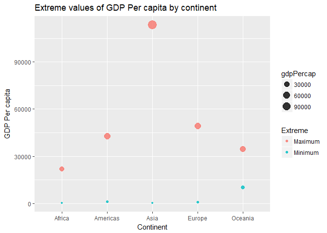
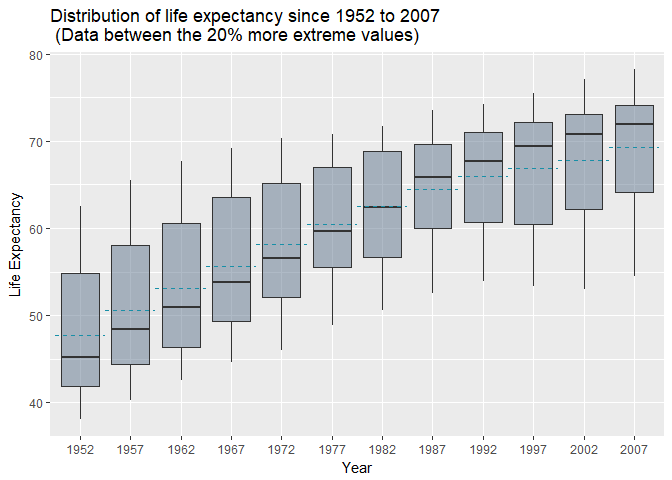
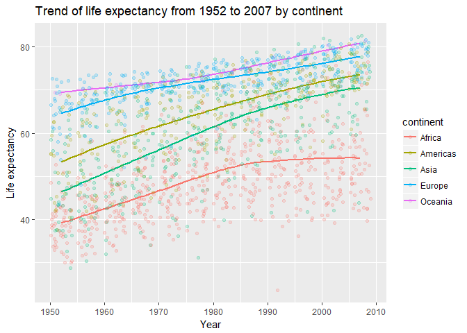
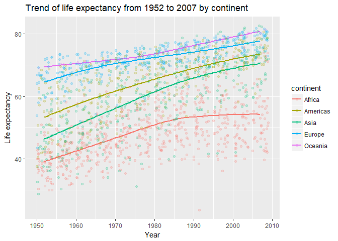
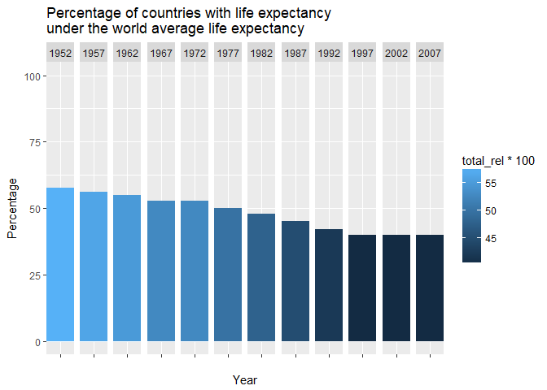

Homework 03: Use dplyr/ggplot2 to manipulate and explore data
================
Cecilia Leon

Task menu
---------

Here are some sample tasks for you to populate your cheat sheet with. If you want to do something comparable but different, i.e. swap one quantitative variable for another, be my guest! If you are feeling inspired and curious, then we're doing this right. Go for it.

-   Get the maximum and minimum of GDP per capita for all continents.

Using `dplyr` I could obtain the maximum and minimum gdpPercap for each continent by the following statement:

``` r
T1 <- gapminder %>% 
group_by(continent) %>% 
summarize(Minimum = round(min(gdpPercap),2),
Maximum = round(max(gdpPercap),2))
```

    ## Warning: package 'bindrcpp' was built under R version 3.3.3

``` r
T1 %>% 
kable(col.names=c("Continent","Minimum","Maximum"))
```

<table>
<thead>
<tr>
<th style="text-align:left;">
Continent
</th>
<th style="text-align:right;">
Minimum
</th>
<th style="text-align:right;">
Maximum
</th>
</tr>
</thead>
<tbody>
<tr>
<td style="text-align:left;">
Africa
</td>
<td style="text-align:right;">
241.17
</td>
<td style="text-align:right;">
21951.21
</td>
</tr>
<tr>
<td style="text-align:left;">
Americas
</td>
<td style="text-align:right;">
1201.64
</td>
<td style="text-align:right;">
42951.65
</td>
</tr>
<tr>
<td style="text-align:left;">
Asia
</td>
<td style="text-align:right;">
331.00
</td>
<td style="text-align:right;">
113523.13
</td>
</tr>
<tr>
<td style="text-align:left;">
Europe
</td>
<td style="text-align:right;">
973.53
</td>
<td style="text-align:right;">
49357.19
</td>
</tr>
<tr>
<td style="text-align:left;">
Oceania
</td>
<td style="text-align:right;">
10039.60
</td>
<td style="text-align:right;">
34435.37
</td>
</tr>
</tbody>
</table>
As I tried to plot maximum and minimum in the same graph by using the previuos table without success, I built the *TT* data frame to have all data about minimum and maximum in the same column, and I added an extra column called *Extreme* to distinghish maximum and minimum of each continent, after that I could generate the following graph:

``` r
TT <- data.frame(rep(T1$continent,2),
c(rep("Maximum",nlevels(T1$continent)),rep("Minimum",nlevels(T1$continent))),
c(T1$Maximum,T1$Minimum))
colnames(TT) <- c("continent","Extreme","gdpPercap")

TT %>% 
kable(col.names=c("Continent","Extreme","gdpPercap"))
```

<table>
<thead>
<tr>
<th style="text-align:left;">
Continent
</th>
<th style="text-align:left;">
Extreme
</th>
<th style="text-align:right;">
gdpPercap
</th>
</tr>
</thead>
<tbody>
<tr>
<td style="text-align:left;">
Africa
</td>
<td style="text-align:left;">
Maximum
</td>
<td style="text-align:right;">
21951.21
</td>
</tr>
<tr>
<td style="text-align:left;">
Americas
</td>
<td style="text-align:left;">
Maximum
</td>
<td style="text-align:right;">
42951.65
</td>
</tr>
<tr>
<td style="text-align:left;">
Asia
</td>
<td style="text-align:left;">
Maximum
</td>
<td style="text-align:right;">
113523.13
</td>
</tr>
<tr>
<td style="text-align:left;">
Europe
</td>
<td style="text-align:left;">
Maximum
</td>
<td style="text-align:right;">
49357.19
</td>
</tr>
<tr>
<td style="text-align:left;">
Oceania
</td>
<td style="text-align:left;">
Maximum
</td>
<td style="text-align:right;">
34435.37
</td>
</tr>
<tr>
<td style="text-align:left;">
Africa
</td>
<td style="text-align:left;">
Minimum
</td>
<td style="text-align:right;">
241.17
</td>
</tr>
<tr>
<td style="text-align:left;">
Americas
</td>
<td style="text-align:left;">
Minimum
</td>
<td style="text-align:right;">
1201.64
</td>
</tr>
<tr>
<td style="text-align:left;">
Asia
</td>
<td style="text-align:left;">
Minimum
</td>
<td style="text-align:right;">
331.00
</td>
</tr>
<tr>
<td style="text-align:left;">
Europe
</td>
<td style="text-align:left;">
Minimum
</td>
<td style="text-align:right;">
973.53
</td>
</tr>
<tr>
<td style="text-align:left;">
Oceania
</td>
<td style="text-align:left;">
Minimum
</td>
<td style="text-align:right;">
10039.60
</td>
</tr>
</tbody>
</table>
``` r
ggplot(TT, aes(continent, gdpPercap, color = Extreme)) +
geom_point(aes(size=gdpPercap),alpha=0.8) +
ggtitle("Extreme values of GDP Per capita by continent") +
xlab("Continent") +
ylab("GDP Per capita")
```



-   Look at the spread of GDP per capita within the continents.

To look at the spread of gdpPercap of each continent we can check the range of that value by continent:

``` r
T1 %>% 
mutate(Range = Maximum - Minimum) %>% 
arrange(Range) %>% 
kable(col.names=c("Continent","Minimum","Maximum","Range"))
```

<table>
<thead>
<tr>
<th style="text-align:left;">
Continent
</th>
<th style="text-align:right;">
Minimum
</th>
<th style="text-align:right;">
Maximum
</th>
<th style="text-align:right;">
Range
</th>
</tr>
</thead>
<tbody>
<tr>
<td style="text-align:left;">
Africa
</td>
<td style="text-align:right;">
241.17
</td>
<td style="text-align:right;">
21951.21
</td>
<td style="text-align:right;">
21710.04
</td>
</tr>
<tr>
<td style="text-align:left;">
Oceania
</td>
<td style="text-align:right;">
10039.60
</td>
<td style="text-align:right;">
34435.37
</td>
<td style="text-align:right;">
24395.77
</td>
</tr>
<tr>
<td style="text-align:left;">
Americas
</td>
<td style="text-align:right;">
1201.64
</td>
<td style="text-align:right;">
42951.65
</td>
<td style="text-align:right;">
41750.01
</td>
</tr>
<tr>
<td style="text-align:left;">
Europe
</td>
<td style="text-align:right;">
973.53
</td>
<td style="text-align:right;">
49357.19
</td>
<td style="text-align:right;">
48383.66
</td>
</tr>
<tr>
<td style="text-align:left;">
Asia
</td>
<td style="text-align:right;">
331.00
</td>
<td style="text-align:right;">
113523.13
</td>
<td style="text-align:right;">
113192.13
</td>
</tr>
</tbody>
</table>
This result allow us to notice that Africa has the smallest spread, this is, Africa is the continent with a distribution of GDP per capita less extreme, contrary to Asia, which has the largest spread. Furthermore, we can observe the entire behaviour of GDP Per Capita by continent, not only the extreme with the assitance of following graph:

``` r
gapminder %>% 
group_by(continent) %>%
ggplot(aes(continent,gdpPercap)) +
geom_violin(fill="#EBF3FB",col="#061A40") +
geom_jitter(col="#0353A4",alpha=0.1) +
ggtitle("Kernel density of GDP per capita by continent") +
xlab("Continent") +
ylab("GDP Per capita")
```


As we can see, the most data of Africa is concentrated at the lower levels of GDP per capita, because of that its spread is the smallest, on the other hand, Asia present some extreme values at the higher leves of GDP Per capita, that is the reason why Asia owns the largest spread.

-   Compute a trimmed mean of life expectancy for different years. Or a weighted mean, weighting by population. Just try something other than the plain vanilla mean.

We are going to calculate the 20% trimmed mean for life expectancy across years:

``` r
T2 <- gapminder %>% 
group_by(year) %>%
filter( lifeExp > quantile(lifeExp,probs = c(.20)) & lifeExp < quantile(lifeExp,probs = c(.80)))

T2 %>% 
summarise(Trimmed_mean = mean(lifeExp)) %>% 
kable(col.names=c("Year","Trimmed mean"))
```

<table>
<thead>
<tr>
<th style="text-align:right;">
Year
</th>
<th style="text-align:right;">
Trimmed mean
</th>
</tr>
</thead>
<tbody>
<tr>
<td style="text-align:right;">
1952
</td>
<td style="text-align:right;">
47.69235
</td>
</tr>
<tr>
<td style="text-align:right;">
1957
</td>
<td style="text-align:right;">
50.58992
</td>
</tr>
<tr>
<td style="text-align:right;">
1962
</td>
<td style="text-align:right;">
53.08304
</td>
</tr>
<tr>
<td style="text-align:right;">
1967
</td>
<td style="text-align:right;">
55.61237
</td>
</tr>
<tr>
<td style="text-align:right;">
1972
</td>
<td style="text-align:right;">
58.12468
</td>
</tr>
<tr>
<td style="text-align:right;">
1977
</td>
<td style="text-align:right;">
60.41490
</td>
</tr>
<tr>
<td style="text-align:right;">
1982
</td>
<td style="text-align:right;">
62.50362
</td>
</tr>
<tr>
<td style="text-align:right;">
1987
</td>
<td style="text-align:right;">
64.51443
</td>
</tr>
<tr>
<td style="text-align:right;">
1992
</td>
<td style="text-align:right;">
65.93610
</td>
</tr>
<tr>
<td style="text-align:right;">
1997
</td>
<td style="text-align:right;">
66.90051
</td>
</tr>
<tr>
<td style="text-align:right;">
2002
</td>
<td style="text-align:right;">
67.85208
</td>
</tr>
<tr>
<td style="text-align:right;">
2007
</td>
<td style="text-align:right;">
69.24321
</td>
</tr>
</tbody>
</table>
``` r
T2 %>% 
ggplot(aes(as.factor(year),lifeExp)) +
geom_boxplot(fill="#5F758E", alpha = 0.5) +
stat_summary(fun.y = mean, geom = "errorbar", aes(ymax = ..y.., ymin = ..y..),
width = 1, linetype = "dashed", col = "#188FA7") +
ggtitle("Distribution of life expectancy since 1952 to 2007 \n (Data between the 20% more extreme values)") +
xlab("Year") +
ylab("Life Expectancy")
```



We can see behaviour of trimmed mean (dotted line) across the years, as we can see at the graph, the spread of life expectancy decreased by the process of trimmed. Moreover we can distinguish two different characteristics on data before and after year 1982. This is, before 1982, the trimmed life expectancy mean was bigger than median, in 1982 mean and median were equivalent, and after 1982 trimmed mean was smaller than median.

-   How is life expectancy changing over time on different continents?

By following table we can appreciate some summary statistics about life expectancy by continent and year, such as the maximum, minimum and mean.

``` r
gapminder %>% 
group_by(continent,year) %>% 
summarise( Min = min(lifeExp),
Mean = mean(lifeExp),
Max = max(lifeExp)) %>% 
kable()
```

<table>
<thead>
<tr>
<th style="text-align:left;">
continent
</th>
<th style="text-align:right;">
year
</th>
<th style="text-align:right;">
Min
</th>
<th style="text-align:right;">
Mean
</th>
<th style="text-align:right;">
Max
</th>
</tr>
</thead>
<tbody>
<tr>
<td style="text-align:left;">
Africa
</td>
<td style="text-align:right;">
1952
</td>
<td style="text-align:right;">
30.000
</td>
<td style="text-align:right;">
39.13550
</td>
<td style="text-align:right;">
52.724
</td>
</tr>
<tr>
<td style="text-align:left;">
Africa
</td>
<td style="text-align:right;">
1957
</td>
<td style="text-align:right;">
31.570
</td>
<td style="text-align:right;">
41.26635
</td>
<td style="text-align:right;">
58.089
</td>
</tr>
<tr>
<td style="text-align:left;">
Africa
</td>
<td style="text-align:right;">
1962
</td>
<td style="text-align:right;">
32.767
</td>
<td style="text-align:right;">
43.31944
</td>
<td style="text-align:right;">
60.246
</td>
</tr>
<tr>
<td style="text-align:left;">
Africa
</td>
<td style="text-align:right;">
1967
</td>
<td style="text-align:right;">
34.113
</td>
<td style="text-align:right;">
45.33454
</td>
<td style="text-align:right;">
61.557
</td>
</tr>
<tr>
<td style="text-align:left;">
Africa
</td>
<td style="text-align:right;">
1972
</td>
<td style="text-align:right;">
35.400
</td>
<td style="text-align:right;">
47.45094
</td>
<td style="text-align:right;">
64.274
</td>
</tr>
<tr>
<td style="text-align:left;">
Africa
</td>
<td style="text-align:right;">
1977
</td>
<td style="text-align:right;">
36.788
</td>
<td style="text-align:right;">
49.58042
</td>
<td style="text-align:right;">
67.064
</td>
</tr>
<tr>
<td style="text-align:left;">
Africa
</td>
<td style="text-align:right;">
1982
</td>
<td style="text-align:right;">
38.445
</td>
<td style="text-align:right;">
51.59287
</td>
<td style="text-align:right;">
69.885
</td>
</tr>
<tr>
<td style="text-align:left;">
Africa
</td>
<td style="text-align:right;">
1987
</td>
<td style="text-align:right;">
39.906
</td>
<td style="text-align:right;">
53.34479
</td>
<td style="text-align:right;">
71.913
</td>
</tr>
<tr>
<td style="text-align:left;">
Africa
</td>
<td style="text-align:right;">
1992
</td>
<td style="text-align:right;">
23.599
</td>
<td style="text-align:right;">
53.62958
</td>
<td style="text-align:right;">
73.615
</td>
</tr>
<tr>
<td style="text-align:left;">
Africa
</td>
<td style="text-align:right;">
1997
</td>
<td style="text-align:right;">
36.087
</td>
<td style="text-align:right;">
53.59827
</td>
<td style="text-align:right;">
74.772
</td>
</tr>
<tr>
<td style="text-align:left;">
Africa
</td>
<td style="text-align:right;">
2002
</td>
<td style="text-align:right;">
39.193
</td>
<td style="text-align:right;">
53.32523
</td>
<td style="text-align:right;">
75.744
</td>
</tr>
<tr>
<td style="text-align:left;">
Africa
</td>
<td style="text-align:right;">
2007
</td>
<td style="text-align:right;">
39.613
</td>
<td style="text-align:right;">
54.80604
</td>
<td style="text-align:right;">
76.442
</td>
</tr>
<tr>
<td style="text-align:left;">
Americas
</td>
<td style="text-align:right;">
1952
</td>
<td style="text-align:right;">
37.579
</td>
<td style="text-align:right;">
53.27984
</td>
<td style="text-align:right;">
68.750
</td>
</tr>
<tr>
<td style="text-align:left;">
Americas
</td>
<td style="text-align:right;">
1957
</td>
<td style="text-align:right;">
40.696
</td>
<td style="text-align:right;">
55.96028
</td>
<td style="text-align:right;">
69.960
</td>
</tr>
<tr>
<td style="text-align:left;">
Americas
</td>
<td style="text-align:right;">
1962
</td>
<td style="text-align:right;">
43.428
</td>
<td style="text-align:right;">
58.39876
</td>
<td style="text-align:right;">
71.300
</td>
</tr>
<tr>
<td style="text-align:left;">
Americas
</td>
<td style="text-align:right;">
1967
</td>
<td style="text-align:right;">
45.032
</td>
<td style="text-align:right;">
60.41092
</td>
<td style="text-align:right;">
72.130
</td>
</tr>
<tr>
<td style="text-align:left;">
Americas
</td>
<td style="text-align:right;">
1972
</td>
<td style="text-align:right;">
46.714
</td>
<td style="text-align:right;">
62.39492
</td>
<td style="text-align:right;">
72.880
</td>
</tr>
<tr>
<td style="text-align:left;">
Americas
</td>
<td style="text-align:right;">
1977
</td>
<td style="text-align:right;">
49.923
</td>
<td style="text-align:right;">
64.39156
</td>
<td style="text-align:right;">
74.210
</td>
</tr>
<tr>
<td style="text-align:left;">
Americas
</td>
<td style="text-align:right;">
1982
</td>
<td style="text-align:right;">
51.461
</td>
<td style="text-align:right;">
66.22884
</td>
<td style="text-align:right;">
75.760
</td>
</tr>
<tr>
<td style="text-align:left;">
Americas
</td>
<td style="text-align:right;">
1987
</td>
<td style="text-align:right;">
53.636
</td>
<td style="text-align:right;">
68.09072
</td>
<td style="text-align:right;">
76.860
</td>
</tr>
<tr>
<td style="text-align:left;">
Americas
</td>
<td style="text-align:right;">
1992
</td>
<td style="text-align:right;">
55.089
</td>
<td style="text-align:right;">
69.56836
</td>
<td style="text-align:right;">
77.950
</td>
</tr>
<tr>
<td style="text-align:left;">
Americas
</td>
<td style="text-align:right;">
1997
</td>
<td style="text-align:right;">
56.671
</td>
<td style="text-align:right;">
71.15048
</td>
<td style="text-align:right;">
78.610
</td>
</tr>
<tr>
<td style="text-align:left;">
Americas
</td>
<td style="text-align:right;">
2002
</td>
<td style="text-align:right;">
58.137
</td>
<td style="text-align:right;">
72.42204
</td>
<td style="text-align:right;">
79.770
</td>
</tr>
<tr>
<td style="text-align:left;">
Americas
</td>
<td style="text-align:right;">
2007
</td>
<td style="text-align:right;">
60.916
</td>
<td style="text-align:right;">
73.60812
</td>
<td style="text-align:right;">
80.653
</td>
</tr>
<tr>
<td style="text-align:left;">
Asia
</td>
<td style="text-align:right;">
1952
</td>
<td style="text-align:right;">
28.801
</td>
<td style="text-align:right;">
46.31439
</td>
<td style="text-align:right;">
65.390
</td>
</tr>
<tr>
<td style="text-align:left;">
Asia
</td>
<td style="text-align:right;">
1957
</td>
<td style="text-align:right;">
30.332
</td>
<td style="text-align:right;">
49.31854
</td>
<td style="text-align:right;">
67.840
</td>
</tr>
<tr>
<td style="text-align:left;">
Asia
</td>
<td style="text-align:right;">
1962
</td>
<td style="text-align:right;">
31.997
</td>
<td style="text-align:right;">
51.56322
</td>
<td style="text-align:right;">
69.390
</td>
</tr>
<tr>
<td style="text-align:left;">
Asia
</td>
<td style="text-align:right;">
1967
</td>
<td style="text-align:right;">
34.020
</td>
<td style="text-align:right;">
54.66364
</td>
<td style="text-align:right;">
71.430
</td>
</tr>
<tr>
<td style="text-align:left;">
Asia
</td>
<td style="text-align:right;">
1972
</td>
<td style="text-align:right;">
36.088
</td>
<td style="text-align:right;">
57.31927
</td>
<td style="text-align:right;">
73.420
</td>
</tr>
<tr>
<td style="text-align:left;">
Asia
</td>
<td style="text-align:right;">
1977
</td>
<td style="text-align:right;">
31.220
</td>
<td style="text-align:right;">
59.61056
</td>
<td style="text-align:right;">
75.380
</td>
</tr>
<tr>
<td style="text-align:left;">
Asia
</td>
<td style="text-align:right;">
1982
</td>
<td style="text-align:right;">
39.854
</td>
<td style="text-align:right;">
62.61794
</td>
<td style="text-align:right;">
77.110
</td>
</tr>
<tr>
<td style="text-align:left;">
Asia
</td>
<td style="text-align:right;">
1987
</td>
<td style="text-align:right;">
40.822
</td>
<td style="text-align:right;">
64.85118
</td>
<td style="text-align:right;">
78.670
</td>
</tr>
<tr>
<td style="text-align:left;">
Asia
</td>
<td style="text-align:right;">
1992
</td>
<td style="text-align:right;">
41.674
</td>
<td style="text-align:right;">
66.53721
</td>
<td style="text-align:right;">
79.360
</td>
</tr>
<tr>
<td style="text-align:left;">
Asia
</td>
<td style="text-align:right;">
1997
</td>
<td style="text-align:right;">
41.763
</td>
<td style="text-align:right;">
68.02052
</td>
<td style="text-align:right;">
80.690
</td>
</tr>
<tr>
<td style="text-align:left;">
Asia
</td>
<td style="text-align:right;">
2002
</td>
<td style="text-align:right;">
42.129
</td>
<td style="text-align:right;">
69.23388
</td>
<td style="text-align:right;">
82.000
</td>
</tr>
<tr>
<td style="text-align:left;">
Asia
</td>
<td style="text-align:right;">
2007
</td>
<td style="text-align:right;">
43.828
</td>
<td style="text-align:right;">
70.72848
</td>
<td style="text-align:right;">
82.603
</td>
</tr>
<tr>
<td style="text-align:left;">
Europe
</td>
<td style="text-align:right;">
1952
</td>
<td style="text-align:right;">
43.585
</td>
<td style="text-align:right;">
64.40850
</td>
<td style="text-align:right;">
72.670
</td>
</tr>
<tr>
<td style="text-align:left;">
Europe
</td>
<td style="text-align:right;">
1957
</td>
<td style="text-align:right;">
48.079
</td>
<td style="text-align:right;">
66.70307
</td>
<td style="text-align:right;">
73.470
</td>
</tr>
<tr>
<td style="text-align:left;">
Europe
</td>
<td style="text-align:right;">
1962
</td>
<td style="text-align:right;">
52.098
</td>
<td style="text-align:right;">
68.53923
</td>
<td style="text-align:right;">
73.680
</td>
</tr>
<tr>
<td style="text-align:left;">
Europe
</td>
<td style="text-align:right;">
1967
</td>
<td style="text-align:right;">
54.336
</td>
<td style="text-align:right;">
69.73760
</td>
<td style="text-align:right;">
74.160
</td>
</tr>
<tr>
<td style="text-align:left;">
Europe
</td>
<td style="text-align:right;">
1972
</td>
<td style="text-align:right;">
57.005
</td>
<td style="text-align:right;">
70.77503
</td>
<td style="text-align:right;">
74.720
</td>
</tr>
<tr>
<td style="text-align:left;">
Europe
</td>
<td style="text-align:right;">
1977
</td>
<td style="text-align:right;">
59.507
</td>
<td style="text-align:right;">
71.93777
</td>
<td style="text-align:right;">
76.110
</td>
</tr>
<tr>
<td style="text-align:left;">
Europe
</td>
<td style="text-align:right;">
1982
</td>
<td style="text-align:right;">
61.036
</td>
<td style="text-align:right;">
72.80640
</td>
<td style="text-align:right;">
76.990
</td>
</tr>
<tr>
<td style="text-align:left;">
Europe
</td>
<td style="text-align:right;">
1987
</td>
<td style="text-align:right;">
63.108
</td>
<td style="text-align:right;">
73.64217
</td>
<td style="text-align:right;">
77.410
</td>
</tr>
<tr>
<td style="text-align:left;">
Europe
</td>
<td style="text-align:right;">
1992
</td>
<td style="text-align:right;">
66.146
</td>
<td style="text-align:right;">
74.44010
</td>
<td style="text-align:right;">
78.770
</td>
</tr>
<tr>
<td style="text-align:left;">
Europe
</td>
<td style="text-align:right;">
1997
</td>
<td style="text-align:right;">
68.835
</td>
<td style="text-align:right;">
75.50517
</td>
<td style="text-align:right;">
79.390
</td>
</tr>
<tr>
<td style="text-align:left;">
Europe
</td>
<td style="text-align:right;">
2002
</td>
<td style="text-align:right;">
70.845
</td>
<td style="text-align:right;">
76.70060
</td>
<td style="text-align:right;">
80.620
</td>
</tr>
<tr>
<td style="text-align:left;">
Europe
</td>
<td style="text-align:right;">
2007
</td>
<td style="text-align:right;">
71.777
</td>
<td style="text-align:right;">
77.64860
</td>
<td style="text-align:right;">
81.757
</td>
</tr>
<tr>
<td style="text-align:left;">
Oceania
</td>
<td style="text-align:right;">
1952
</td>
<td style="text-align:right;">
69.120
</td>
<td style="text-align:right;">
69.25500
</td>
<td style="text-align:right;">
69.390
</td>
</tr>
<tr>
<td style="text-align:left;">
Oceania
</td>
<td style="text-align:right;">
1957
</td>
<td style="text-align:right;">
70.260
</td>
<td style="text-align:right;">
70.29500
</td>
<td style="text-align:right;">
70.330
</td>
</tr>
<tr>
<td style="text-align:left;">
Oceania
</td>
<td style="text-align:right;">
1962
</td>
<td style="text-align:right;">
70.930
</td>
<td style="text-align:right;">
71.08500
</td>
<td style="text-align:right;">
71.240
</td>
</tr>
<tr>
<td style="text-align:left;">
Oceania
</td>
<td style="text-align:right;">
1967
</td>
<td style="text-align:right;">
71.100
</td>
<td style="text-align:right;">
71.31000
</td>
<td style="text-align:right;">
71.520
</td>
</tr>
<tr>
<td style="text-align:left;">
Oceania
</td>
<td style="text-align:right;">
1972
</td>
<td style="text-align:right;">
71.890
</td>
<td style="text-align:right;">
71.91000
</td>
<td style="text-align:right;">
71.930
</td>
</tr>
<tr>
<td style="text-align:left;">
Oceania
</td>
<td style="text-align:right;">
1977
</td>
<td style="text-align:right;">
72.220
</td>
<td style="text-align:right;">
72.85500
</td>
<td style="text-align:right;">
73.490
</td>
</tr>
<tr>
<td style="text-align:left;">
Oceania
</td>
<td style="text-align:right;">
1982
</td>
<td style="text-align:right;">
73.840
</td>
<td style="text-align:right;">
74.29000
</td>
<td style="text-align:right;">
74.740
</td>
</tr>
<tr>
<td style="text-align:left;">
Oceania
</td>
<td style="text-align:right;">
1987
</td>
<td style="text-align:right;">
74.320
</td>
<td style="text-align:right;">
75.32000
</td>
<td style="text-align:right;">
76.320
</td>
</tr>
<tr>
<td style="text-align:left;">
Oceania
</td>
<td style="text-align:right;">
1992
</td>
<td style="text-align:right;">
76.330
</td>
<td style="text-align:right;">
76.94500
</td>
<td style="text-align:right;">
77.560
</td>
</tr>
<tr>
<td style="text-align:left;">
Oceania
</td>
<td style="text-align:right;">
1997
</td>
<td style="text-align:right;">
77.550
</td>
<td style="text-align:right;">
78.19000
</td>
<td style="text-align:right;">
78.830
</td>
</tr>
<tr>
<td style="text-align:left;">
Oceania
</td>
<td style="text-align:right;">
2002
</td>
<td style="text-align:right;">
79.110
</td>
<td style="text-align:right;">
79.74000
</td>
<td style="text-align:right;">
80.370
</td>
</tr>
<tr>
<td style="text-align:left;">
Oceania
</td>
<td style="text-align:right;">
2007
</td>
<td style="text-align:right;">
80.204
</td>
<td style="text-align:right;">
80.71950
</td>
<td style="text-align:right;">
81.235
</td>
</tr>
</tbody>
</table>
``` r
gapminder %>% 
group_by(continent,year) %>% 
ggplot(aes(year,lifeExp,color = continent)) +
geom_smooth(se=FALSE) +
geom_jitter(alpha = 0.2) +
ggtitle("Trend of life expectancy from 1952 to 2007 by continent") +
xlab("Year") +
ylab("Life expectancy")
```

    ## `geom_smooth()` using method = 'loess'



As we can see, the ranking of life expectancy has been the same during this period, with Oceania being the continent with highest life expectancy, followed by Europe. On the other hand, Americas and Asia has shown a similar growth rate, being Americas the country with ths highest life expectancy in comparison with Asia and Africa, this last has owned the lowest life expectancy, and also showed the slowest growth rate from the year 1992.

-   Report the absolute and/or relative abundance of countries with low life expectancy over time by continent: Compute some measure of worldwide life expectancy – you decide – a mean or median or some other quantile or perhaps your current age. Then determine how many countries on each continent have a life expectancy less than this benchmark, for each year.

*This was very messy to me since I had to generate a repetition vector with the world life expectancy mean by year, and then add that vector to a new column of gapminder. However, if the order of year on gapminder changes, following statement wont work correctly.*

``` r
word_mean <- gapminder %>% 
group_by(year) %>% 
summarise(word_mean = mean(lifeExp)) 

mydf <- gapminder %>%  
mutate(word_mean = unlist(rep(word_mean[,2], nlevels(country)))) %>% 
mutate(counter = if_else(lifeExp < word_mean,1,0)) %>% 
group_by(year) %>% 
summarise(total_abs = sum(counter),
total_rel = sum(counter)/length(counter))

mydf %>% 
kable(col.names=c("Year","Total absolute","Total relative"))
```

<table>
<thead>
<tr>
<th style="text-align:right;">
Year
</th>
<th style="text-align:right;">
Total absolute
</th>
<th style="text-align:right;">
Total relative
</th>
</tr>
</thead>
<tbody>
<tr>
<td style="text-align:right;">
1952
</td>
<td style="text-align:right;">
82
</td>
<td style="text-align:right;">
0.5774648
</td>
</tr>
<tr>
<td style="text-align:right;">
1957
</td>
<td style="text-align:right;">
80
</td>
<td style="text-align:right;">
0.5633803
</td>
</tr>
<tr>
<td style="text-align:right;">
1962
</td>
<td style="text-align:right;">
78
</td>
<td style="text-align:right;">
0.5492958
</td>
</tr>
<tr>
<td style="text-align:right;">
1967
</td>
<td style="text-align:right;">
75
</td>
<td style="text-align:right;">
0.5281690
</td>
</tr>
<tr>
<td style="text-align:right;">
1972
</td>
<td style="text-align:right;">
75
</td>
<td style="text-align:right;">
0.5281690
</td>
</tr>
<tr>
<td style="text-align:right;">
1977
</td>
<td style="text-align:right;">
71
</td>
<td style="text-align:right;">
0.5000000
</td>
</tr>
<tr>
<td style="text-align:right;">
1982
</td>
<td style="text-align:right;">
68
</td>
<td style="text-align:right;">
0.4788732
</td>
</tr>
<tr>
<td style="text-align:right;">
1987
</td>
<td style="text-align:right;">
64
</td>
<td style="text-align:right;">
0.4507042
</td>
</tr>
<tr>
<td style="text-align:right;">
1992
</td>
<td style="text-align:right;">
60
</td>
<td style="text-align:right;">
0.4225352
</td>
</tr>
<tr>
<td style="text-align:right;">
1997
</td>
<td style="text-align:right;">
57
</td>
<td style="text-align:right;">
0.4014085
</td>
</tr>
<tr>
<td style="text-align:right;">
2002
</td>
<td style="text-align:right;">
57
</td>
<td style="text-align:right;">
0.4014085
</td>
</tr>
<tr>
<td style="text-align:right;">
2007
</td>
<td style="text-align:right;">
57
</td>
<td style="text-align:right;">
0.4014085
</td>
</tr>
</tbody>
</table>
``` r
mydf %>% 
ggplot(aes(x="",y=total_rel*100,fill=total_rel*100)) +
geom_bar(width = 1, stat = "identity") +
scale_y_continuous(limits=c(0,100)) +
facet_grid(~year) +
ggtitle("Percentage of countries with life expectancy \nunder the world average life expectancy") +
xlab("Year") +
ylab("Percentage")
```



-   Find countries with interesting stories. Open-ended and, therefore, hard. Promising but unsuccessful attempts are encouraged. This will generate interesting questions to follow up on in class.

In the next table, it is showed what continents presented a life expectancy mean under or over the average of all continents life expectancy by year.

``` r
T3 <- gapminder %>% 
group_by(year,continent) %>%
summarize(average = mean(lifeExp)) %>% 
mutate(Level = if_else(average<mean(average),"Under word average","Over word average"))

# Example for 1952
T3 %>% 
filter(year == 1952) %>% 
kable()
```

<table>
<thead>
<tr>
<th style="text-align:right;">
year
</th>
<th style="text-align:left;">
continent
</th>
<th style="text-align:right;">
average
</th>
<th style="text-align:left;">
Level
</th>
</tr>
</thead>
<tbody>
<tr>
<td style="text-align:right;">
1952
</td>
<td style="text-align:left;">
Africa
</td>
<td style="text-align:right;">
39.13550
</td>
<td style="text-align:left;">
Under word average
</td>
</tr>
<tr>
<td style="text-align:right;">
1952
</td>
<td style="text-align:left;">
Americas
</td>
<td style="text-align:right;">
53.27984
</td>
<td style="text-align:left;">
Under word average
</td>
</tr>
<tr>
<td style="text-align:right;">
1952
</td>
<td style="text-align:left;">
Asia
</td>
<td style="text-align:right;">
46.31439
</td>
<td style="text-align:left;">
Under word average
</td>
</tr>
<tr>
<td style="text-align:right;">
1952
</td>
<td style="text-align:left;">
Europe
</td>
<td style="text-align:right;">
64.40850
</td>
<td style="text-align:left;">
Over word average
</td>
</tr>
<tr>
<td style="text-align:right;">
1952
</td>
<td style="text-align:left;">
Oceania
</td>
<td style="text-align:right;">
69.25500
</td>
<td style="text-align:left;">
Over word average
</td>
</tr>
</tbody>
</table>
``` r
#Example for 2007
T3 %>% 
filter(year == 2007) %>% 
kable()
```

<table>
<thead>
<tr>
<th style="text-align:right;">
year
</th>
<th style="text-align:left;">
continent
</th>
<th style="text-align:right;">
average
</th>
<th style="text-align:left;">
Level
</th>
</tr>
</thead>
<tbody>
<tr>
<td style="text-align:right;">
2007
</td>
<td style="text-align:left;">
Africa
</td>
<td style="text-align:right;">
54.80604
</td>
<td style="text-align:left;">
Under word average
</td>
</tr>
<tr>
<td style="text-align:right;">
2007
</td>
<td style="text-align:left;">
Americas
</td>
<td style="text-align:right;">
73.60812
</td>
<td style="text-align:left;">
Over word average
</td>
</tr>
<tr>
<td style="text-align:right;">
2007
</td>
<td style="text-align:left;">
Asia
</td>
<td style="text-align:right;">
70.72848
</td>
<td style="text-align:left;">
Under word average
</td>
</tr>
<tr>
<td style="text-align:right;">
2007
</td>
<td style="text-align:left;">
Europe
</td>
<td style="text-align:right;">
77.64860
</td>
<td style="text-align:left;">
Over word average
</td>
</tr>
<tr>
<td style="text-align:right;">
2007
</td>
<td style="text-align:left;">
Oceania
</td>
<td style="text-align:right;">
80.71950
</td>
<td style="text-align:left;">
Over word average
</td>
</tr>
</tbody>
</table>
As we can see, Americas started by presenting life expectancy under the world average on 1952, but at year 2007, Americas had life expectancy mean over the world average. Furthermore, we can see that all continents presented incresing trends of life expectancy across years, so the fact tha Americas got to position over the world average may obey some countries of Americas improved their life expectancy. We are goind to try detecting some of this countris by the assistance of following graph:

``` r
T4 <- gapminder %>% 
filter(continent == "Americas", year==2007) %>%
mutate(growth_rate = lifeExp - first(lifeExp)) %>% 
arrange(desc(growth_rate))

head(T4) %>% 
kable(col.names=c("Country","Continent","Year","lifeExp","pop","gdpPercap","Growth"))
```

<table>
<thead>
<tr>
<th style="text-align:left;">
Country
</th>
<th style="text-align:left;">
Continent
</th>
<th style="text-align:right;">
Year
</th>
<th style="text-align:right;">
lifeExp
</th>
<th style="text-align:right;">
pop
</th>
<th style="text-align:right;">
gdpPercap
</th>
<th style="text-align:right;">
Growth
</th>
</tr>
</thead>
<tbody>
<tr>
<td style="text-align:left;">
Canada
</td>
<td style="text-align:left;">
Americas
</td>
<td style="text-align:right;">
2007
</td>
<td style="text-align:right;">
80.653
</td>
<td style="text-align:right;">
33390141
</td>
<td style="text-align:right;">
36319.235
</td>
<td style="text-align:right;">
5.333
</td>
</tr>
<tr>
<td style="text-align:left;">
Costa Rica
</td>
<td style="text-align:left;">
Americas
</td>
<td style="text-align:right;">
2007
</td>
<td style="text-align:right;">
78.782
</td>
<td style="text-align:right;">
4133884
</td>
<td style="text-align:right;">
9645.061
</td>
<td style="text-align:right;">
3.462
</td>
</tr>
<tr>
<td style="text-align:left;">
Puerto Rico
</td>
<td style="text-align:left;">
Americas
</td>
<td style="text-align:right;">
2007
</td>
<td style="text-align:right;">
78.746
</td>
<td style="text-align:right;">
3942491
</td>
<td style="text-align:right;">
19328.709
</td>
<td style="text-align:right;">
3.426
</td>
</tr>
<tr>
<td style="text-align:left;">
Chile
</td>
<td style="text-align:left;">
Americas
</td>
<td style="text-align:right;">
2007
</td>
<td style="text-align:right;">
78.553
</td>
<td style="text-align:right;">
16284741
</td>
<td style="text-align:right;">
13171.639
</td>
<td style="text-align:right;">
3.233
</td>
</tr>
<tr>
<td style="text-align:left;">
Cuba
</td>
<td style="text-align:left;">
Americas
</td>
<td style="text-align:right;">
2007
</td>
<td style="text-align:right;">
78.273
</td>
<td style="text-align:right;">
11416987
</td>
<td style="text-align:right;">
8948.103
</td>
<td style="text-align:right;">
2.953
</td>
</tr>
<tr>
<td style="text-align:left;">
United States
</td>
<td style="text-align:left;">
Americas
</td>
<td style="text-align:right;">
2007
</td>
<td style="text-align:right;">
78.242
</td>
<td style="text-align:right;">
301139947
</td>
<td style="text-align:right;">
42951.653
</td>
<td style="text-align:right;">
2.922
</td>
</tr>
</tbody>
</table>
``` r
gapminder %>% 
filter(continent == "Americas", country%in%head(T4)$country) %>% 
group_by(year) %>% 
ggplot(aes(year,lifeExp,color = country)) +
geom_smooth(se=FALSE) +
ggtitle("Trend of life expectancy from 1952 to 2007 by countries of Americas") +
xlab("Year") +
ylab("Life expectancy")
```

    ## `geom_smooth()` using method = 'loess'



About this result we can highligth the behaviour of Costa Rica and Cuba, since both countries presented a change in their growth rate from the year 1882, when it appears they had a more accelerated growth rate.
